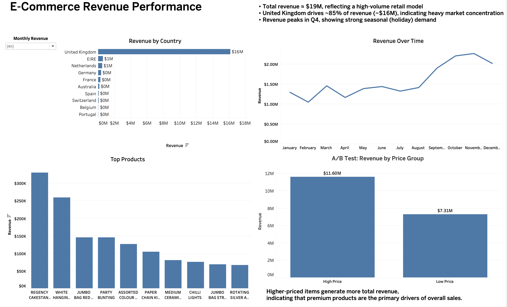

# 📊 E-Commerce Revenue Analysis Dashboard

## 🔗 Live Dashboard
https://public.tableau.com/views/Book3_17777537461960/Dashboard1?:language=en-US&:display_count=n

---

## 📌 Project Overview
This project analyzes an e-commerce dataset (~975K transactions) to identify key revenue drivers across geography, product performance, time trends, and pricing strategy. The analysis was conducted using SQL for data cleaning and Tableau for visualization.

---

## 💼 Business Problem
The objective is to understand:
- What drives revenue growth
- How sales vary across countries and products
- Whether pricing impacts overall performance
- How seasonality affects demand

---

## 📂 Dataset
**Source:**  
https://www.kaggle.com/datasets/mashlyn/online-retail-ii-uci  

**Fields include:**
- InvoiceNo  
- Description  
- Quantity  
- InvoiceDate  
- UnitPrice  
- CustomerID  
- Country  

---

## 🧹 Data Cleaning
- Removed transactions with negative quantities (returns)  
- Removed null Customer IDs  
- Removed invalid or zero pricing values  
- Created **Revenue = Quantity × UnitPrice**  

This ensured accurate and reliable revenue analysis.

---

## 📊 Dashboard

The Tableau dashboard includes:

- **Revenue by Country** → Identifies geographic revenue concentration  
- **Top Products** → Highlights highest-performing items  
- **Revenue Over Time** → Shows seasonal demand patterns  
- **A/B Test (Price Segmentation)** → Compares revenue across pricing groups  

---

## 🔍 Key Insights

The business generates approximately **$19M in total revenue**, with the **United Kingdom contributing ~ 85% (~$16M)**, indicating strong dependence on a single market. Revenue is driven by high-performing decorative and gift-oriented products, reflecting a high-volume retail model. Sales are highly seasonal, with revenue **peaking in Q4 and declining in Q1**, showing strong holiday demand patterns. Additionally, higher-priced products generate more total revenue (**~$11.6M vs ~$7.3M**), indicating that premium products are key drivers of overall sales performance.

---

## 🧪 A/B Test (Price Segmentation)
This is a simulated A/B test using price segmentation (not a controlled experiment).

- Higher-priced products generate more total revenue  
- Premium items contribute more significantly to overall sales performance  

---

## 🎯 Business Recommendations
- Focus on **high-value (premium) products** to maximize revenue  
- Reduce dependency on the UK by expanding into other markets  
- Leverage **Q4 seasonal demand** through targeted promotions  
- Improve data quality by separating operational entries (e.g., Manual/Postage)  

---

## 🛠️ Tools Used
- SQL (PostgreSQL) → Data cleaning & transformation  
- Tableau → Data visualization & dashboard  
- Excel → Data handling  

---
